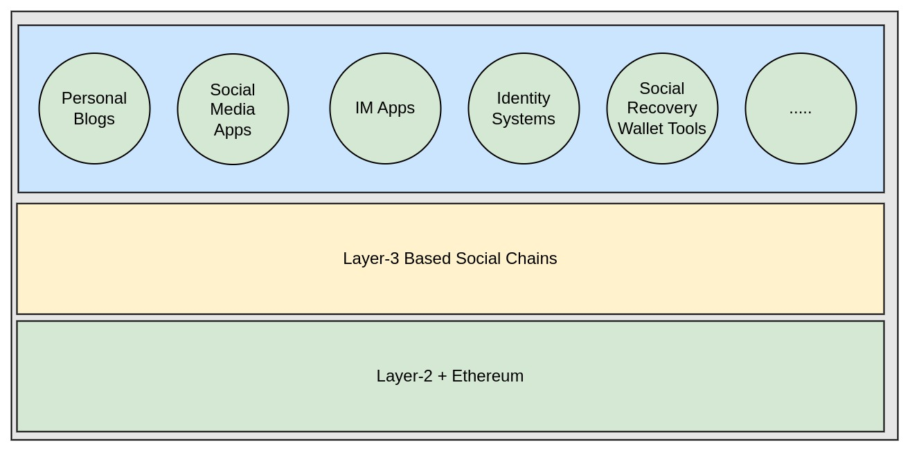
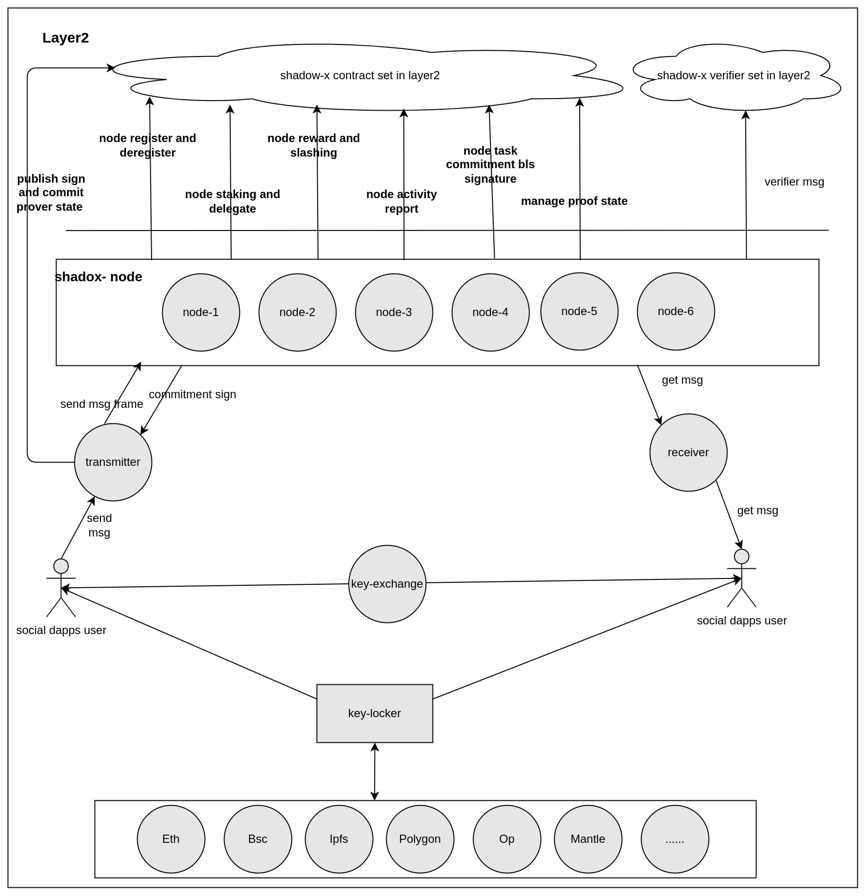
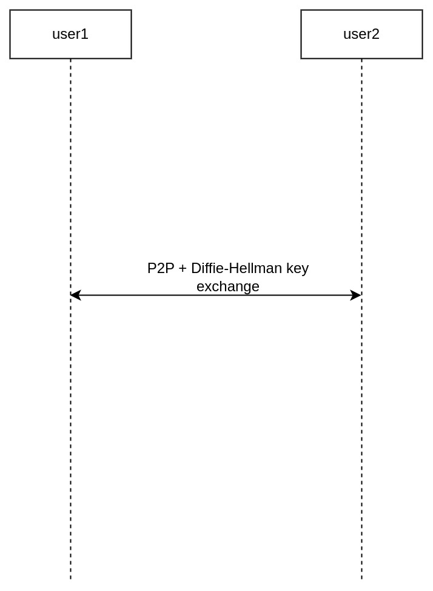
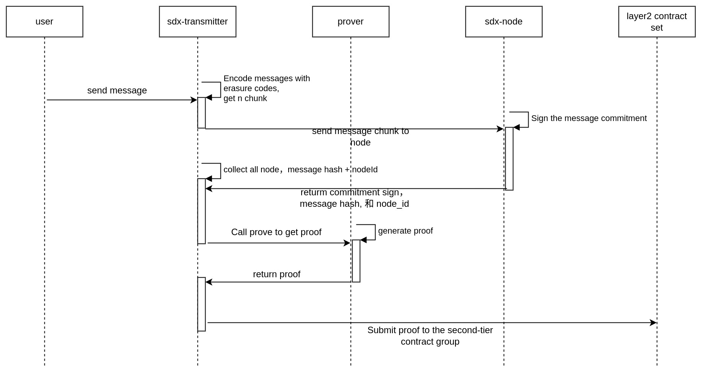
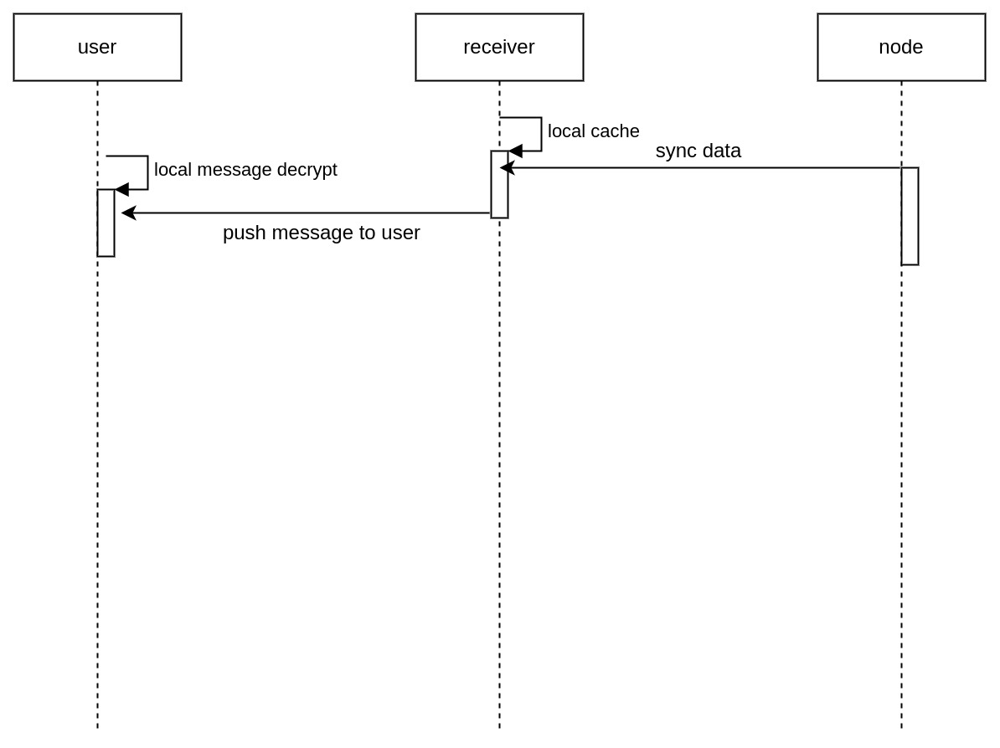
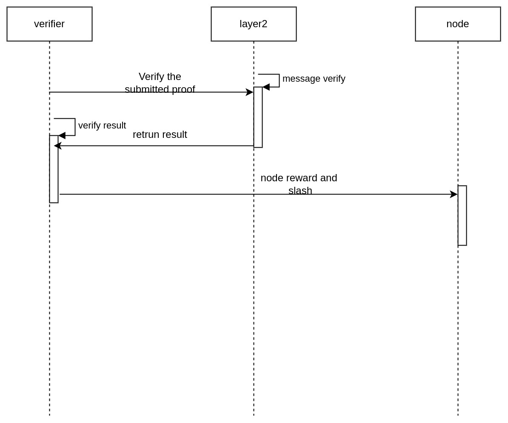

# Privacy-focused Social Wallet Infrastructure Based on Layer-3

## Background

:::tip

On existing social networks, user identity and content are platform commodities. Data moats and targeted advertising services lead to misaligned incentives between platforms and the people using them. No one owns the information they share, yet users’ data is remixed by algorithms on centralized platforms that farm and profit from their attention.— [Abhi Vyas | Mem Protocol CEO](https://blog.mem.co/seed/)

:::

Today instant messaging apps require personal information to be shared as the basic condition just to sign up and start using them. This holds true for Whatsapp, Telegram, and many more messaging apps dominating the market. The decentralized alternatives that have surfaced in recent years have tried to address the issue, and they have done so successfully to a certain extent. But building a messaging infrastructure directly on Layer-1 (L1) has its own drawbacks as it gets difficult to juggle between security and scalibility once the network effect starts to kick in.

## Introduction

We're building Layer-3 (L3) based social infrastructure that supports privacy messaging for social dApps, as well as internal message passing for systems working with sensitive data, ensuring data security and efficiency. We deliver high performance at a significantly lower cost than existing social graph protocols such as Lens that use third-party data storage. Shadow-X can also enable social recovery for wallets without using any centralized technology such as Email, which is used by popular providers such as Unipass.

Shadow-X enables the following usecases:
- Social recovery for wallets
- Social networking functionality for dApps
- DID-based identity systems

### Characteristics

- Limited security
- Strong privacy
- Low cost
- Support for social and content centric dApps at scale
- Completely Decentralized

### Project Comparison

|            | Lens Protocol                        | Shadow-X (placeholder)               |
|------------------|-------------------------------------|-------------------------------------|
| Technology       | Optimism Layer3 + Polygon DA         | ZK proof Layer3, Native DA           |
| Costs            | High                                | Low                                 |
| Performance      | Consensus takes place on Polygon DA  | No consensus on DA layer, high performance |
| Data Security    | High                                | Relatively Limited                   |
| Privacy          | Limited                             | High                                |
| Integration Cost | High                                | Low                                 |

## Implementation

It functions like an instant messaging app, but has underlying L3 privacy chain infrastructure that can support other dApps too.

The L3 privacy chain is used as the social carrier of the shadow-x project. Users enter the shadow-app by creating a wallet or importing a wallet. Each wallet address is used as a valid social account, and users can use the wallet address as a social account. ID communicates in our ecology.

## Architecture

### 1. Architecture overview

- Build a richer privacy-focused ecosystem on Mantle
- Provide existing users a better on-chain experience and on-board new users by addressing a growing need in the community

- Layer3 基础设施(技术架构)
  - 解决隐私性
  - 去中心化的托管和支付
  - 完全去中心化同时能达到中心化的处理能力---> v 神文章论据
  - 所有的社交应用都可以接入
  
- 上层应用产品
  - 提供全币种的社交恢复钱包支持
  - 提供去中心化的隐私社交
  - SocialGameFi--->
  - 上层应用接入收费，再让用户去跑节点，将收取的服务以奖励的形式发发放给 node

解决市场上的什么样的痛点，网络效应

两个问题：1. 我把这个节点网络去掉，用一个中心化服务来替代的话有什么问题？为什么这个比signal靠谱？2. 除了聊天软件以外还有其他应用场景吗？

**Process explanation: Taking a chat interaction between User 1 and User2 as an example:**

1. User1 sends a message to the transmitter service first, and then the transmitter encodes the message and divides it into multiple chunks using erasure code, and then sends those chunks to a node. 
2. Upon receiving these chunks, the node stores them in a local database and makes a commitment signature for the chunk it received. 
3. The transmitter collects the commitment signature and combines the node ID, and the chunk hash into a Merkle Patricia Trie (MPT) and generates proofs according to the ZK message circuit, and then publishes the commitment signature and the root of the message to L2. 
4. There is a contract set on L2 containing the economic model and message proof verifier. The verifier is responsible for verifying the validity and accuracy of the message chunks.

### 2. Architecture details

2.1 Key-locker

Key-locker is a decentralized key recovery tool that can perform blockchain recovery and social recovery for keys, passwords, private keys, mnemonics and other secrets.

2.2 Key-exchange

Key-exchange is a peer-to-peer key exchange tool that relies on P2P communication.

2.3 Transmitter

The Transmitter receives the message sent by the user, and encodes the message into multiple chunks using the erasure code, and then sends the chunk to the node. The node makes a commitment signature for the chunk it receives, and the transmitter collects the signature and combines the node and the chunk into a Merkle Patricia Trie (MPT) and generates proofs according to the ZK message circuit, and publishes the commitment signature and the root proof of the message to the chain.

2.4 Receiver

The receiver is to obtain information related to itself from the node, and push it to the user after the calculation is restored.

2.5 Layer2 verifier contract set

Proves the validity and authenticity of the messages stored by the node

2.6 Validator

A set of nodes storing message chunks

2.7 Layer2 contract set

A set of contracts that manage validators, including node registration and exit, pledge, rewards, penalties, etc.

2.8 Zk circum(go and rust)

A separate service that can generate corresponding off-chain proofs for verifier verification based on the mpt of the message

## Function Modules

### 1. Key-locker :white_check_mark:

See the overall design of Key-locker

### 2. Key-exchange :white_check_mark:

### 3. Transmitter

### 4. Receiver

### 5. Verifier

### 6. Validator(Redesign while developing)

6.1  Node Register

6.2  Node DeRegister

6.3 Node staking

6.4 Node slashing

6.5 Node Withdraw

6.6 Node deposit

6.7 User deposit

6.8 User staking delegate to node

6.9 Users increase staking to nodes

6.10 Users decrease staking to nodes

6.11 User staking to node

6.12 User Withdraw

6.13 Node receives message storage

6.14 Node commitment signature

### 7. Layer2 contract set

### 8. Zk circuits (go and rust)

8.1 Message variable length circuit

8.2 Merkle tree circuit

## API Protocol

### 1. Api 
   
1.1 sdx_status

1.2 sdx_getBlock

1.3 sdx_getBlockByNumber

1.4 sdx_getMessageById

1.5 sdx_getOperators

1.6 sdx_getOperatorById

## Project Checklist

[x] Key-locker
[x] Key-exchange
[] Transmitter
[] Receiver
[] Layer2 verifier contract set
[] Validator
[] Layer2 contract set
[] Zk 电路(go 和 rust)