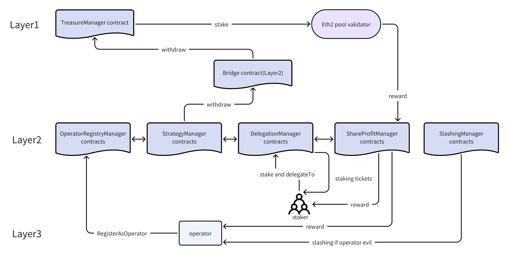

# Shadow-x Layer3 Reverse restaking protocol 

## 1. Background

- This staking protocol will be used for layer3 tokenenomics;
- After operator or staker stake their layer two eth(WETH) on our system, they will get staking tickets,  our system staking reward and layer one Eth staking reward;
- Reverse staking flow:  
  - Operator or staker stake their layer two eth(WETH) on our system;
  - When staking eth reaches 32, we will withdraw 32 ETH to layer one, and staking 32 ETH to layer one validator;
  - On layer two, when operators save batch data, the staker will get a reward from layer 3 network;
  - On layer one,  stakers will get rewards from the ethereum network;
  - And stakers can get staking tickets from layer two. Any app docking our system must have tickets; Stakers can transfer those tickets to other third party projects to get income.

## 2. Architecture

- Operator:  Save data node on shadow-x
- Staker:  Staker eth or weth on shadow-x, and delegate to operator
- TreasureManager: Manage eth on layer one,  interact with pool validator
- Pool validator:  beacon chain validator

## 3. Business flow

### 3.1 Operator

- Shadow-x node regist as operator who can accept staker's staking and delegate
- Staker staking eth or weth for operator
- Shadow-x node registers its bls key and can accept slashing
- Operators save batch data and get rewards from every storage task
- If operators are evil, it will get a slashing.

### 3.2 Staker

- Staking eth or weth to shadow-x's contracts and delegate vote weight to operator.
- Stakers will get rewards when the operators save batch data.
- Stakers delegate their vote weight to the operators. This stands for if the operator is evil, they can accept slashing their shares. So when operators are evil, stakers will be slashed

### 3.3 Staking on layer one

- When the eth amount reaches multiples of 32,  all of those eth will withdraw to layer one.
- And then treasure contracts will stake those eth to beacon chain pool validator

### 3.4 Reward from layer two

- Staker stake on layer 2, they will get operator storage rewards and staking tickets.
- Any third-party service that wants to dock our system needs staking tickets.

### 3.5 Reward from layer one

- We staking in layer one eth will get rewards from validators, and those rewards will come back to ShareProfit contracts, and then rewards will be distributed to stakers.

## 4. Detail design

### 4.1 Strategy Manager contracts

### 4.2 OperatorRigster Manager contracts

### 4.3 Delegation Manager contracts

### 4.4 ShareProfit Manager contracts

### 4.5 Slashing  contracts

## 5. Summary

For this staking protocol. Stakers who can get third rewards from our ecosystem, the first is layer1 eth staking rewards from beacon chain validator, the second is layer2 reward from shadow-x  economics incentives. And the third is staking tickets. The function of staking tickets is that any social dapps dock our layer3 network needs it.

Because staker staking and claim reward on layer2, the transaction fee is cheaper than layer1. I think this can attract users to enter our protocol by staking their eth and weth.

And in this protocol, if operators are evil, stakers will be slashed. Thus, stakes who delegate their vote weight to operators stand for them believe the operators.