# NFT

## Overview
NFT is a module of the Eniac xDao project. It is a product module related to NFT memorabilia, NFT avatars, NFT leasing, NFT rewards, NFT social, NFT recommendations, NFT transactions and other functions. The entire product is supported by the Eniac xDao NFT aggregator, whose core is one-click NFT minting, multi-chain and multi-platform data synchronization. Except for the NFT recommendation function, other functions are developed entirely by smart contracts and are completely decentralized. Of course, our goal is to create a truly decentralized, multi-functional, multi-chain, multi-platform supported NFT product.

## Project Architecture

## Function Description

### NFT Memorabilia
NFT memorabilia is mainly to provide services for various event sponsors and project parties. They can mint relevant commemorative NFTs based on our Eniac x platform to give to their event participants, customers and other groups. The main feature of NFT memorabilia is that users other than the whitelist cannot transfer the NFT. After event participants or customer groups get this NFT, they are not allowed to transfer it to others in principle.

### NFT Avatar
NFT avatar refers to users being able to set any NFT they own as their avatar. If a user owns a high-value NFT, he can lend it to others for use as an avatar. Of course, users can also mint relevant NFTs through the Eniac x platform as their avatars. Eniac x’s NFT minting material library can contain materials such as emotions and skin for users to choose from, providing basic and premium versions. The basic version provides free minting to serve those customers who do not want to spend money.

### NFT Leasing
Simply put, NFT leasing means that I own a very valuable NFT whose copyright belongs to me. Anyone else who needs to use this NFT must lease it from me. For example, I own a very valuable monkey. A clothing manufacturer wants to print this monkey on their clothes. So they can come and lease the usage rights of this monkey from me. During the lease period, they can continue to use this monkey within the scope allowed by the leased industry.

### NFT Rewards
Support rewards in cryptocurrencies and NFTs.

The contribution (spread reading volume, revenue generated) of content propagators who help forward and share rewards is linked to rewards received. Reward sharers participate in dividend distribution.

Outstanding comments are decided by users. Comments can also receive rewards.

Eniac x will cooperate with some blockchain community media. Of course there will also be some circle modules within Eniac x. Users can directly reward authors with NFTs when they see good articles written by others. In the early stage, our product will connect and cooperate with the Wenwo Community and Lianyan Community to make blockchain rewards.

### NFT Social (This function needs to be outlined after the private chat is completed)
It will be outlined in the future private chat product based on NFT design.

### NFT Recommendation and Tracking Service
Categorize and organize NFTs and recommend relevant NFTs to users, and describe NFT classifications to help users choose better NFT investments.

For example: When a user is viewing a shared Bored Ape NFT from a friend on OpenSea, clicking on our built-in assistant tool can display NFT rarity analysis, apply to add holder friends, subscribe to receive transaction dynamics reminders for each NFT (time of buy/sell, address, platform, price).

### NFT Transactions (Mortgage Loan)
A completely decentralized NFT marketplace where all quotes, inquiries, auctions, transactions and mortgage transaction data are implemented on chain.

### Blue Chip NFT Endorsement Protocol
Encourage and attract blue-chip NFT holders to earn money on our platform, expanding the existing applications and brand consumption attributes of NFTs. For example: Pledging Punks NFT can accept short-term endorsement orders according to industry and term. Only one can be accepted in the same product category for the same period. We serve as the guarantee protocol platform and collect service fees.

## Summary
In summary, the overall planning of our entire NFT product should be like this for now. Except for section 5, everything needs to be implemented this year.

Please let me know if you would like me to modify or expand the translation. I’m happy to make edits to ensure it conveys the meaning accurately.
